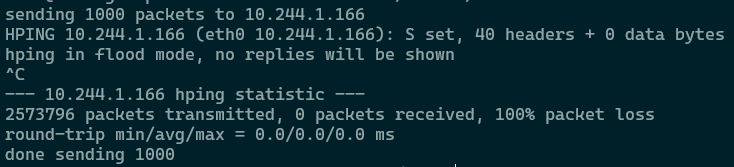
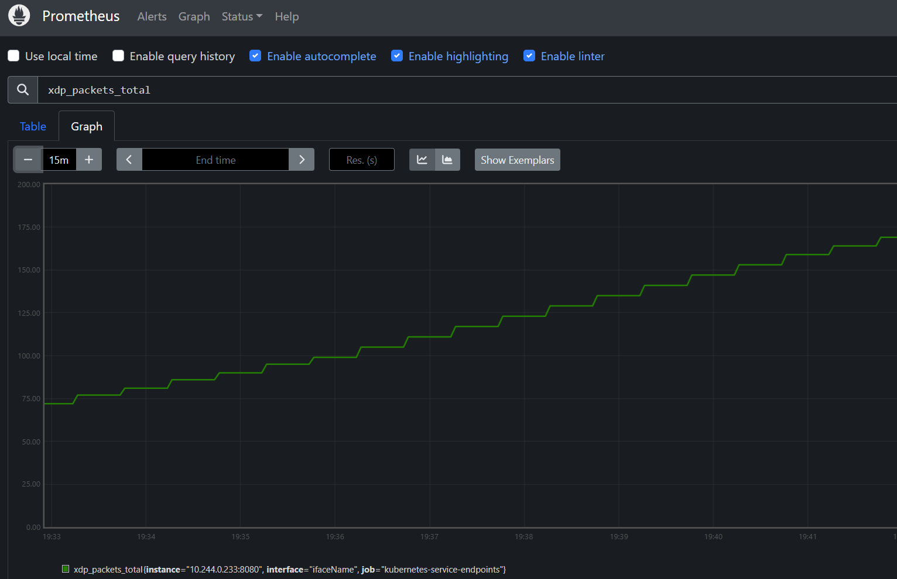

# xdp-prometheus
The xdp-prometheus project is designed to collect eBPF metrics and expose them to Prometheus for monitoring. It includes the source code and deployment configuration necessary to build, run, and deploy the application. The project leverages eBPF programs to gather metrics at the kernel level and uses Prometheus to make these metrics accessible for monitoring and analysis.

The repository is structured with various files and directories, including a Dockerfile for building the Docker image, Kubernetes deployment configurations, Go module dependencies, and the main application code written in Go. The eBPF program source code is contained in xdp_ebpf.c, and its compiled output is in xdp_ebpf.o. The project requires Docker, Kubernetes, and Go 1.22.7 or higher to build and run.

The [xdp_ebpf.c](bpf/xdp_ebpf.c) file contains an eBPF program designed for DDoS protection using XDP (eXpress Data Path). It includes necessary Linux kernel headers and defines constants for rate limiting, such as the maximum packets per second (THRESHOLD) and the time window in nanoseconds (TIME_WINDOW_NS). The program maintains a hash map (rate_limit_map) to track the rate limit for each source IP address, storing the last update timestamp and packet count within the time window. The ddos_protection function, marked with the SEC("xdp") section, processes incoming packets, starting by parsing the Ethernet header. It checks if the packet is an IP packet and ensures that the packet data is within bounds before proceeding with further processing. If the packet is not an IP packet or the data is out of bounds, it passes the packet without any action.



## Repository structure
```
  . 
  ├── bpf
  | └── xdp_ebpf.c
  ├── deploy 
  |  └── deploy.yaml.tmpl
  ├── Dockerfile
  ├── go.mod
  ├── go.sum
  |── main.go
  └── Makefile
```

* deploy.yaml: Kubernetes deployment and service configuration.
* Dockerfile: Instructions to build the Docker image.
* go.mod: Go module dependencies.
* go.sum: Go module dependency checksums.
* main: Directory containing the main application code.
* main.go: Entry point for the Go application.
* Makefile: Makefile for building and managing the project.
* xdp_ebpf.c: eBPF program source code.
* xdp_ebpf.o: Compiled eBPF program.

## Prerequisites

* Docker
* Kubernetes
* Go 1.22.7+

## Building the Project
To build the project, run:

```sh
make build
```

## Running the Project
To run the project locally, use:

```sh
make run
```

## Create docker image
To create a docker image

```sh
make docker
```

>NOTE: image registry and namespace can be set as follows: `make docker IMAGE_REGISTRY=docker.io IMAGE_NAMESPACE=someone`


## Deploying to Kubernetes
To deploy the application to a Kubernetes cluster, apply the [deploy.yaml](deploy.yaml) file:

```sh
kubectl apply -f deploy.yaml
```

## Accessing Metrics
Once deployed, the metrics will be exposed on port 8080 of the xdp-prometheus service. You can access them using Prometheus by configuring a scrape job for the service.



If Prometheus is not configured to scrape from the `default` namespace, a job needs to be added to Prometheus `scrape_config`:

```yaml
scrape_configs:
  - job_name: 'kubernetes-service-endpoints'
    kubernetes_sd_configs:
      - role: endpoints
    relabel_configs:
      - source_labels: [__meta_kubernetes_namespace]
        action: keep
        regex: defaul
```

## Test

To test a DDoS attack, you can use `hping` tool, here is a script

```sh
#!/bin/bash
TARGET_IP=10.244.1.166 # update this!!
TARGET_PORT=80
INTERFACE="eth0"

echo "sending 1000 packets to $TARGET_IP"
hping3 --flood --count 1000 --interface $INTERFACE --destport $TARGET_PORT --syn $TARGET_IP
echo "done sending 1000"
```

## License
This project is licensed under the MIT License. See the LICENSE file for details.