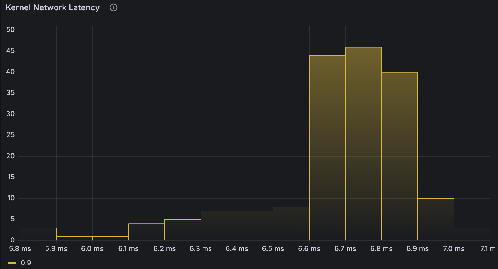

## Kernel Network Latency
This program is an eBPF-based network latency monitoring tool that collects and exposes network packet latency metrics to Prometheus. It utilizes eBPF (Extended Berkeley Packet Filter) to attach probes to kernel functions related to packet reception and processing. The program captures timestamps at different stages of packet processing, calculates the latency, and records the source and destination IP addresses along with the protocol type. The collected data is then exposed as Prometheus metrics, which can be scraped and visualized using Prometheus and Grafana.

The program sets up a ring buffer to read events from the eBPF program and processes these events in a separate goroutine. It converts the raw data into human-readable format and updates Prometheus metrics accordingly. The metrics include a gauge for the number of packets received and a histogram for the latency distribution. Additionally, the program starts an HTTP server to serve the Prometheus metrics endpoint, allowing Prometheus to scrape the metrics at regular intervals. This setup provides a powerful and efficient way to monitor network latency in real-time.




## BPF program Deescription

This program is an eBPF (extended Berkeley Packet Filter) program written in C. It is designed to measure the latency of IP packets as they are processed by the Linux kernel. Here's a step-by-step explanation of how it works:

1. Includes and Definitions:
    - The program includes several headers required for eBPF programs.
    - It defines a constant ETH_P_IP for the IP protocol.

2. Data Structures:
    - struct l3: Holds layer 3 (network layer) information such as source and destination IP addresses and protocol.
    - struct latency_t: Holds timestamps for when a packet is received and processed, the time difference (latency), and the layer 3 information.

3. Maps:
    - latency_map: A hash map that stores latency information for packets, keyed by a unique identifier.
    - events: A ring buffer used to send events (latency information) to user space.


4. Helper Functions:
    - build_l3: Constructs an l3 structure from an IP header and socket buffer.
    - get_key: Extracts a unique key (hash) from a socket buffer.
    - get_iphdr: Retrieves the IP header from a socket buffer.

5. Kprobe Handlers:
    - ip_rcv: This function is attached to the ip_rcv kernel function. It:
      * Retrieves the socket buffer and IP header.
      * Builds a unique key and layer 3 structure.
      * Initializes a latency_t structure with the current timestamp and layer 3 information.
      * Updates the latency_map with this information.
    - ip_rcv_finish: This function is attached to the ip_rcv_finish kernel function. It:
      * Retrieves the socket buffer and IP header.
      * Looks up the corresponding latency_t structure in the latency_map using the unique key.
      * If found, it updates the timestamp_out and calculates the latency.
      * Prints the latency and sends the information to user space via the ring buffer.
      * Deletes the entry from the latency_map.

6. License:
    - The program specifies that it is licensed under the GPL.
    Overall, this eBPF program measures the time taken for IP packets to be processed by the kernel and sends this latency information to user space.

## Prerequisites

* Docker
* Kubernetes
* Go 1.22.7+

## Installation

1. **Install Go**: Follow the instructions on the [official Go website](https://golang.org/doc/install). In Ubuntu/Debian you can also install go as follows:
    ```sh
    sudo apt install golang-go
    echo 'export GOPATH=$HOME/go' >> ~/.profile
    echo 'export PATH=$GOPATH/bin:$PATH' >> ~/.profile
    source ~/.profile
    ```
2. **Install clang, llvm, libbpf and make**:
    ```sh
    sudo apt-get install clang llvm libbpf-dev make -y
    ```
3. **Clone the repository**:
    ```sh
    git clone https://github.com/srodi/ebpf-prometheus-metrics.git
    cd ebpf-prometheus-metrics
    ```
4. **Add the correct include path**
    If the header files `types.h` are located in a different directory than `/usr/include/asm`, you can add the include path manually via environment variable `C_INCLUDE_PATH`:

    ```sh
    # ensure asm/types.h exists in the expected directory
    find /usr/include -name 'types.h'

    # example for Ubuntu 24.04 x86_64 
    export C_INCLUDE_PATH=/usr/include/x86_64-linux-gnu
    ```

## Building the Project
To build the project, run:

```sh
make build
```

## Running the Project
To run the project locally, use:

```sh
make run
```

# Containerization

For the next steps you need Docker, Kubectl (with access to a Kubernetes cluster), and Helm installed on your system.

## Create docker image
To create a docker image

```sh
make docker
```

>NOTE: image registry and namespace can be set as follows: `make docker IMAGE_REGISTRY=docker.io IMAGE_NAMESPACE=someone`


## Deploying to Kubernetes
To deploy the application to a Kubernetes cluster, apply the [deploy.yaml](deploy.yaml) file:

```sh
make deploy
```

## Prometheus Metrics
Once deployed to Kubernetes, the metrics will be exposed on port `2112` of the `ebpf-network-latency` service. The metrics exposed are `packets_count` and `latency_histogram*`. If you do not have Prometheus installed, simply use this target:

```sh
make prometheus
```

If you are already running Prometheus, you can access the metrics by configuring a scrape job for the service. If Prometheus is not configured to scrape from the `default` namespace, a job needs to be added to Prometheus `scrape_config`:

```yaml
scrape_configs:
  - job_name: 'kubernetes-service-endpoints'
    kubernetes_sd_configs:
      - role: endpoints
    relabel_configs:
      - source_labels: [__meta_kubernetes_namespace]
        action: keep
        regex: default
```

## Grafana Dashboard
The json template for Grafana dashboard is found at [grafana/dashboard.json](./grafana/dashboard.json).

> Note: Grafana is already deployed as part of `prometheus-community/kube-prometheus-stack` Helm chart. So if you deployed Prometheus with `make prometheus`, you can simply port-forward Grafana and access the UI. From the UI you will be able to create a new dashboard by importing the json mentioned above.

## License
This project is licensed under the MIT License. See the LICENSE file for details.