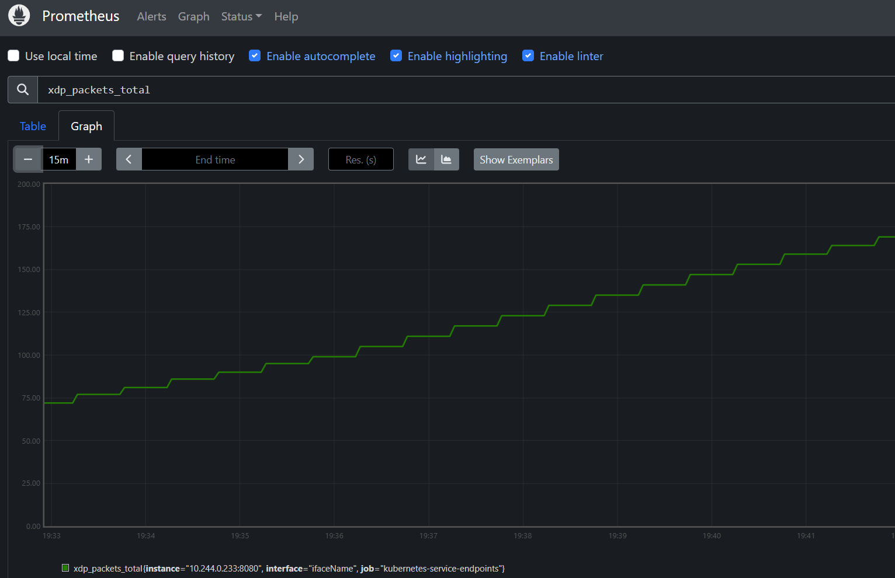

# xdp-prometheus
This repository contains the source code and deployment configuration for the xdp-prometheus project, which collects eBPF metrics and exposes them to Prometheus.

## Repository structure
```
.gitignore
deploy.yaml
Dockerfile
go.mod
go.sum
main
main.go
Makefile
xdp_ebpf.c
xdp_ebpf.o
```

* deploy.yaml: Kubernetes deployment and service configuration.
* Dockerfile: Instructions to build the Docker image.
* go.mod: Go module dependencies.
* go.sum: Go module dependency checksums.
* main: Directory containing the main application code.
* main.go: Entry point for the Go application.
* Makefile: Makefile for building and managing the project.
* xdp_ebpf.c: eBPF program source code.
* xdp_ebpf.o: Compiled eBPF program.

## Prerequisites

* Docker
* Kubernetes
* Go 1.22.7+

## Building the Project
To build the project, run:

```sh
make build
```

## Running the Project
To run the project locally, use:

```sh
make run
```

## Create docker image
To create a docker image

```sh
make docker
```

>NOTE: image registry and namespace can be set as follows: `make docker IMAGE_REGISTRY=docker.io IMAGE_NAMESPACE=someone`


## Deploying to Kubernetes
To deploy the application to a Kubernetes cluster, apply the [deploy.yaml](deploy.yaml) file:

```sh
kubectl apply -f deploy.yaml
```

## Accessing Metrics
Once deployed, the metrics will be exposed on port 8080 of the xdp-prometheus service. You can access them using Prometheus by configuring a scrape job for the service.



## License
This project is licensed under the MIT License. See the LICENSE file for details.